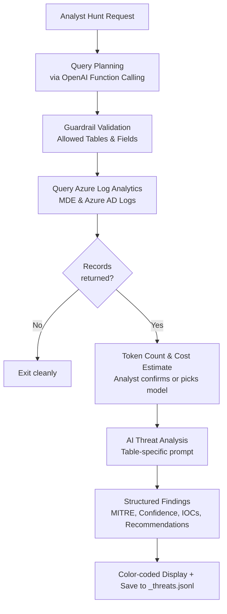

# Agentic AI Threat Hunting Tool

An agentic threat hunting tool that turns an analyst's hypothesis into a scoped investigation against Microsoft Azure telemetry. You state what you suspect in natural language, and the agent reasons about where the evidence would live, constructs a KQL query, pulls the matching records from your Log Analytics workspace, and runs a grounded analysis pass that returns findings mapped to MITRE ATT&CK, scored for confidence, and enriched with IOCs and recommended response actions.

It is built for the Tier 2 and Tier 3 workflow: scope the hunt, query the high signal source, triage what comes back, and decide whether to pivot, escalate, or stand down. The agent handles the mechanical parts of that loop, the table selection, the query construction, the first pass triage across hundreds of events, so the analyst spends their attention on the findings rather than on writing KQL and eyeballing raw logs.

## The Core Idea

1. **Plan.** The model reads your request and, using OpenAI function calling, fills in a fixed set of parameters: which table to search, which fields to return, who or what to scope to, and how far back to look. It also explains its reasoning. It does not author the query itself.
2. **Fetch.** Your own code takes those parameters and slots them into a safe, pre written KQL template, then runs that against Azure. The model picks the ingredients. The code writes the recipe.
3. **Analyze.** The logs that come back are handed to a second model call along with a prompt that is tailored to the specific table being hunted. The model is told to stay grounded in the actual log data and to return its findings in a strict JSON structure.

That separation is the whole point. The model reasons about intent and evidence. The code stays in control of anything that touches your environment.

## How It Works

## Key Features

* Natural language threat hunting. You describe the concern in normal words, for example "someone may have logged into our tenant in the last day."
* Intelligent table and field selection using OpenAI function calling.
* Code authored KQL. A pre written query populated with validated values, never raw queries written by the model.
* Allow list validation of tables and fields before any query runs.
* Token counting and cost estimation with interactive, tier aware model selection.
* Real time querying of Azure Log Analytics, covering Microsoft Defender for Endpoint and Azure AD sign in logs.
* Automated MITRE ATT&CK mapping with confidence scoring and extracted indicators of compromise.
* Actionable recommendations for each finding.

---

## A Full Run, Stage by Stage

This is a real run of the tool. Each step shows what the analyst sees and what the system is doing underneath, so you can follow the whole pipeline from a vague worry to a set of concrete findings.

### 1. You start with a plain English worry

 

The agent greets you and asks what you want to do. In this run the analyst typed:

> "I'm worried someone has logged into our tenant in the last day or so, or some other malicious activity has happened."

Behind the scenes this becomes the input to the planning step. Rather than searching blindly, the agent will first reason about where to look and how to scope the search.

---

### 2. The agent plans the query and explains itself

The agent sends the request to the planning model. Using OpenAI function calling, the model has to return a complete, structured query plan. In this run it chose:

* **Table:** SigninLogs
* **Time range:** 24 hours
* **Fields:** TimeGenerated, UserPrincipalName, OperationName, Category, ResultSignature, ResultDescription, AppDisplayName, IPAddress, LocationDetails
It also returned a rationale, which the tool prints so the analyst can sanity check the agent's thinking before anything runs:

> "User is concerned about tenant sign ins in the last day. SigninLogs is the high signal table for Azure AD sign ins. 24 hour window matches 'last day'. Fields chosen capture time, user, operation, success or failure, app, IP and location to spot suspicious or anomalous sign ins. No specific user or device was provided so query is tenant wide."

This rationale step is deliberate. The agent has to justify its plan in plain language, which makes its reasoning auditable.

---

### 3. The guardrail validates the plan

Before any query runs, the chosen table and fields are checked against an allow list. If the model had hallucinated a field name or picked a table that is not permitted, the program stops immediately. The model proposes, the code enforces.

---

### 4. The query is built and run

If zero records come back, the tool exits cleanly rather than wasting a model call.

---

### 5. Tokens, cost, and model choice

Logs get big fast, so before spending anything the tool counts the tokens with tiktoken and estimates what each available model would cost. It checks two separate limits for every model: the context window (can the input even fit) and your account's tokens per minute rate limit. Everything is color coded, and you get to switch models before committing.

This is a second human checkpoint, this time on cost. In this run the full tenant wide hunt over 1026 sign in events cost about four cents.

---

### 6. The hunt

The terminal showing "Selected model is valid", "Initiating cognitive threat hunt against target logs", and "Cognitive hunt complete. Took 165.48 seconds and found 3 potential threats!"

---

### 7. The three findings from this run were:

**Finding 1**. Repeated strong auth failures followed by successful sign ins for a single account. Mapped to T1110 and T1078, flagged as a possible MFA bypass or targeted authentication attempt, confidence Medium to High.

**Finding 2**. Sign in blocked due to a known malicious IP. Mapped to T1595 and T1078, confidence High.

**Finding 3**. Distributed failed credential validation across the tenant. A password spray and brute force pattern across many accounts and source IPs, mapped to T1110.001, confidence Medium.

## Architecture and Project Layout

| File | Responsibility |
| --- | --- |
| `_main.py` | The orchestrator. Sets up the Azure and OpenAI clients, then runs the pipeline stage by stage. |
| `PROMPT_MANAGEMENT.py` | All prompts and the function calling schema. Holds the planner prompt, the analyst prompt, the per table specialist prompts, the output schema, and the tool definition. |
| `EXECUTOR.py` | The engine. Gets the query plan from the model, builds and runs a pre written query populated with validated values against Azure, and runs the analysis call. |
| `MODEL_MANAGEMENT.py` | Token counting, cost estimation, and the interactive, tier aware model picker. |
| `GUARDRAILS.py` | The allow lists for tables, fields, and models, plus the validation functions that enforce them. |
| `UTILITIES.py` | Sanitizing the query plan and displaying the plan, rationale, and findings. |
| `_keys.py` | Your secrets. Not committed. See setup below. |

The design choice worth calling out is the separation of concerns. Planning the query, validating it, fetching the data, controlling cost, and analyzing the results are all distinct steps owned by distinct modules. That makes each piece easy to reason about and easy to change on its own.

### Prerequisites

* Python 3.11 or newer.
* An Azure subscription with a Log Analytics workspace that is collecting Microsoft Defender for Endpoint and/or Azure AD logs.
* An OpenAI API key.
* The Azure CLI, so the tool can authenticate to Azure.
