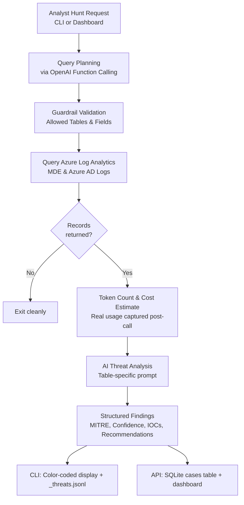

# Agentic AI Threat Hunting Tool
 
An agentic threat hunting tool that turns an analyst's hypothesis into a scoped investigation against Microsoft Azure telemetry. You state what you suspect in natural language. The agent reasons about where the evidence would live, builds a KQL query, and pulls the matching records from your Log Analytics workspace. It then runs a grounded analysis pass that returns findings mapped to MITRE ATT&CK, scored for confidence, and enriched with IOCs and recommended response actions.
 
It is built for the Tier 2 and Tier 3 workflow: scope the hunt, query the high signal source, triage what comes back, and decide whether to pivot, escalate, or stand down. The agent handles the mechanical parts of that loop. It picks the table, constructs the query, and runs first pass triage across hundreds of events, so you spend your attention on the findings instead of writing KQL and eyeballing raw logs.
 
This engine runs two ways. As a standalone CLI (`_main.py`) — the original interactive tool, results printed to the terminal and logged to `_threats.jsonl`. Or as a REST API (`api.py`) that exposes the same pipeline over HTTP, persists results to a SQLite database instead of a flat file, and powers a companion web dashboard.
 

---

**Platform stack**
- Azure Log Analytics
- Microsoft Defender for Endpoint
- OpenAI API
- Python + FastAPI
Integrated with a companion Next.js dashboard, which drives this engine over its REST API.
 
 
 
## The Core Idea
 
1. **Plan.** The model reads your request and, using OpenAI function calling, fills in a fixed set of parameters: which table to search, which fields to return, who or what to scope to, and how far back to look. It also explains its reasoning. It does not author the query itself.
2. **Fetch.** Your own code takes those parameters and slots them into a safe, pre written KQL template, then runs that against Azure. The model picks the ingredients. The code writes the recipe.
3. **Analyze.** The logs that come back are handed to a second model call along with a prompt that is tailored to the specific table being hunted. The model is told to stay grounded in the actual log data and to return its findings in a strict JSON structure.
## How It Works
 

 
## Key Features
 
* Natural language threat hunting. You describe the concern in normal words, for example "someone may have logged into our tenant in the last day."
* Intelligent table and field selection using OpenAI function calling.
* Code authored KQL. A pre written query populated with validated values, never raw queries written by the model.
* Allow list validation of tables and fields before any query runs.
* Token counting and cost estimation, with real per-hunt token usage and dollar cost captured from the model's actual API response and persisted alongside each case.
* Real time querying of Azure Log Analytics, covering Microsoft Defender for Endpoint and Azure AD sign in logs.
* Automated MITRE ATT&CK mapping with confidence scoring and extracted indicators of compromise.
* Actionable recommendations for each finding.
* A FastAPI REST layer (`api.py`) exposing the full pipeline as HTTP endpoints, backed by a SQLite database for cases, analyst notes, and per-hunt cost tracking, so the tool can drive a web dashboard on top of the same engine.
---
 
## A Full Run, Stage by Stage
 
This is a real run of the tool. Each step shows what the analyst sees and what the system is doing underneath
 
### 1. You start with a plain English worry
 
 
 
 
---
 
 
### 2. The agent plans the query and explains itself
 

 

 
---
 
### 3. The guardrail validates the plan
 

Before any query runs, the chosen table and fields are checked against an allow list. If the model had hallucinated a field name or picked a table that is not permitted, the program stops immediately. The model proposes, the code enforces.
 
---
 
### 4. The query is built and run
 

 
If zero records come back, the tool exits cleanly rather than wasting a model call.
 
---
 
### 5. Tokens, cost, and model choice
 

 
---
 
### 6. The hunt
 
 

 
---
 
### 7. The three findings from this run were:
 
**Finding 1**. Repeated strong auth failures followed by successful sign ins for a single account. Mapped to T1110 and T1078, flagged as a possible MFA bypass or targeted authentication attempt, confidence Medium to High.

 
**Finding 2**. Sign in blocked due to a known malicious IP. Mapped to T1595 and T1078, confidence High.

 
**Finding 3**. Distributed failed credential validation across the tenant. A password spray and brute force pattern across many accounts and source IPs, mapped to T1110.001, confidence Medium.

 
---
 
## Web Dashboard
 
The CLI is where this engine started, but every hunt above can also be triggered from A companion Next.js dashboard that sits on top of this engine's REST API (`api.py`), giving an analyst a full case-management workflow: run hunts from a web form instead of a prompt, track each finding as a case with a status (open, investigating, resolved, ignored), attach analyst notes, view MITRE ATT&CK patterns aggregated across every case, and see real AI cost tracked per investigation.

 ---
 
**Dashboard repo:** [link to your dashboard repo here]
